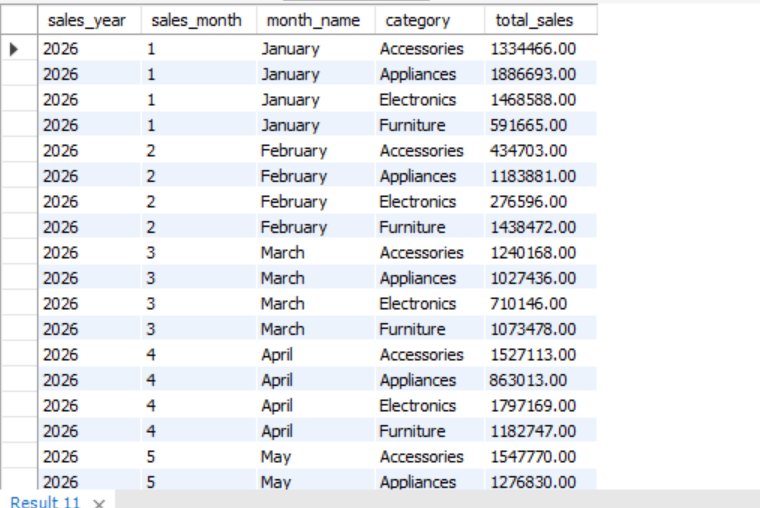
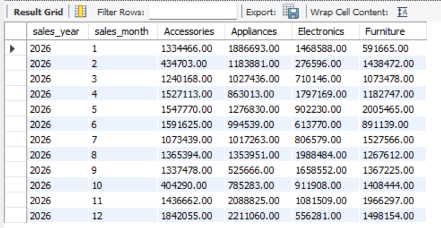
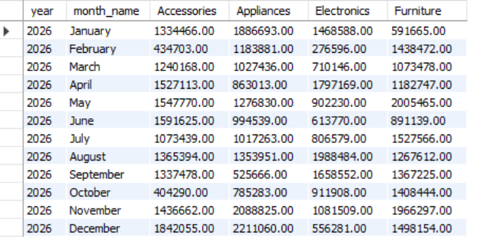
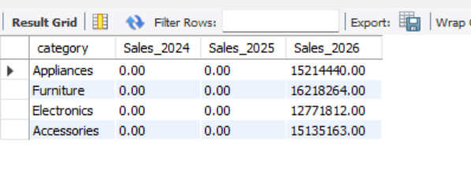
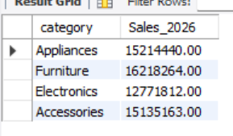

# 📊 Project 08 - SQL Cross-Tabulation and Pivoting

## 📌 Project Overview

This project demonstrates how to transform row-based sales data into a pivot table format using SQL. It covers both static and dynamic pivoting techniques to create business-friendly reports for sales analysis.

The project uses aggregate functions, `CASE` expressions, `GROUP_CONCAT()`, dynamic SQL, and SQL Views to generate cross-tab reports.

---

## 🎯 Objectives

- Transform rows into columns using SQL.
- Build static pivot tables using `CASE`.
- Generate dynamic pivot tables using `GROUP_CONCAT()`.
- Aggregate sales by month and product category.
- Create reusable reporting views.

---

## 🛠️ Technologies Used

- MySQL 8+
- SQL
- CASE Expressions
- GROUP_CONCAT()
- Dynamic SQL
- Aggregate Functions
- SQL Views
- Git
- GitHub

---

## 📂 Project Structure

```text
Project08_Pivoting_SQL/
│
├── screenshots/
│   ├── monthly_category_sales.png
│   ├── static_category_pivot.png
│   ├── dynamic_category_pivot.png
│   ├── yearly_category_pivot.png
│   └── dynamic_yearly_category_pivot.png
│
├── sql/
│   ├── monthly_category_sales.sql
│   ├── static_category_pivot.sql
│   ├── dynamic_category_pivot.sql
│   ├── yearly_category_pivot.sql
│   ├── dynamic_yearly_category_pivot.sql
│   ├── sales_pivot_view.sql
│   └── validate_results.sql
│
├── README.md
└── .gitignore
```

---

# 📚 SQL Concepts Covered

- CASE
- GROUP_CONCAT()
- Dynamic SQL
- PREPARE
- EXECUTE
- Aggregate Functions
- GROUP BY
- CREATE VIEW

---

# 📸 Project Screenshots

## 1. Monthly Category Sales

**Objective**

Aggregate monthly sales by product category to create the base dataset for pivoting.

**SQL Concepts Used**

- GROUP BY
- SUM()
- Aggregate Functions



---

## 2. Static Category Pivot

**Objective**

Transform product categories from rows into columns using `CASE` expressions.

**SQL Concepts Used**

- CASE
- SUM()
- GROUP BY



---

## 3. Dynamic Category Pivot

**Objective**

Generate pivot columns dynamically using `GROUP_CONCAT()` and execute the generated SQL.

**SQL Concepts Used**

- GROUP_CONCAT()
- Dynamic SQL
- PREPARE
- EXECUTE



---

## 4. Yearly Category Pivot

**Objective**

Create a yearly cross-tab report showing sales across product categories.

**SQL Concepts Used**

- CASE
- Aggregate Functions
- GROUP BY



---

## 5. Dynamic Yearly Category Pivot

**Objective**

Automatically generate yearly pivot reports without hardcoding category columns.

**SQL Concepts Used**

- GROUP_CONCAT()
- Dynamic SQL
- PREPARE
- EXECUTE



---

# 📈 Key Features

- Monthly Sales Reporting
- Static SQL Pivot
- Dynamic SQL Pivot
- Yearly Sales Pivot
- Cross-Tabulation Reports
- Dynamic Column Generation
- Reusable SQL Reporting

---

# 💼 Real-World Applications

- Business Intelligence Dashboards
- Sales Reporting
- Management Reports
- Cross-Tab Analysis
- Financial Reporting
- Data Warehouse Reporting

---

# 🎓 Learning Outcomes

Through this project, I learned how to:

- Transform row-based data into pivot tables.
- Implement static pivoting using `CASE`.
- Generate dynamic pivot columns using `GROUP_CONCAT()`.
- Execute dynamically generated SQL using `PREPARE` and `EXECUTE`.
- Build reusable SQL reports for business analytics.

---

# 👨‍💻 Author

**Snehal Thombre**

Aspiring Data Engineer

GitHub: https://github.com/snehalwork

Thank you